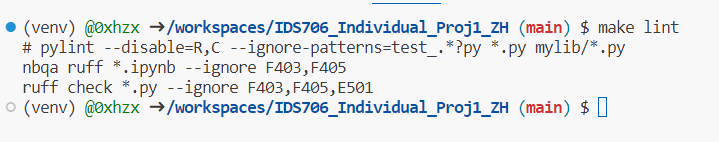
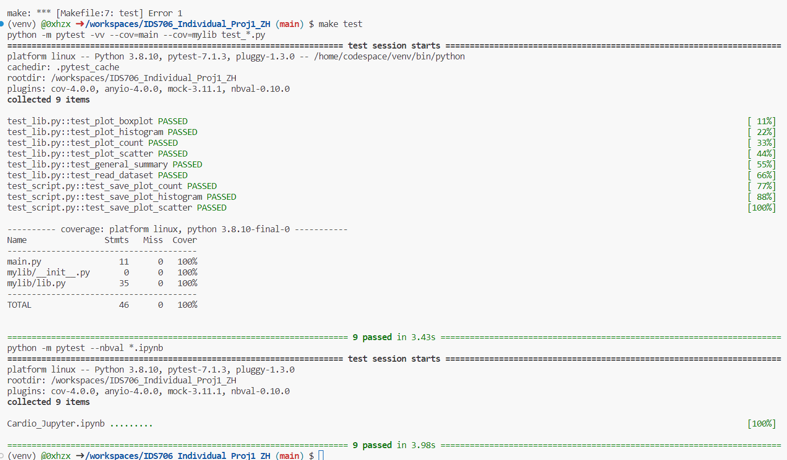
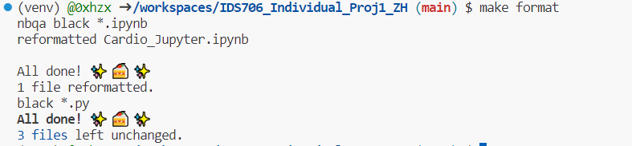
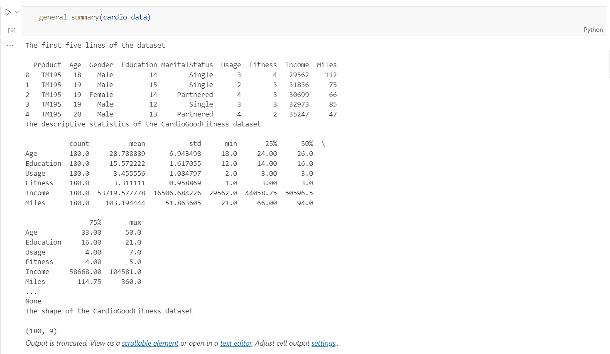
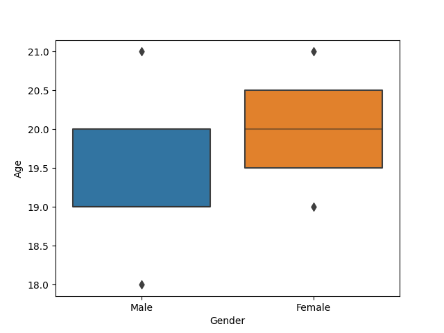
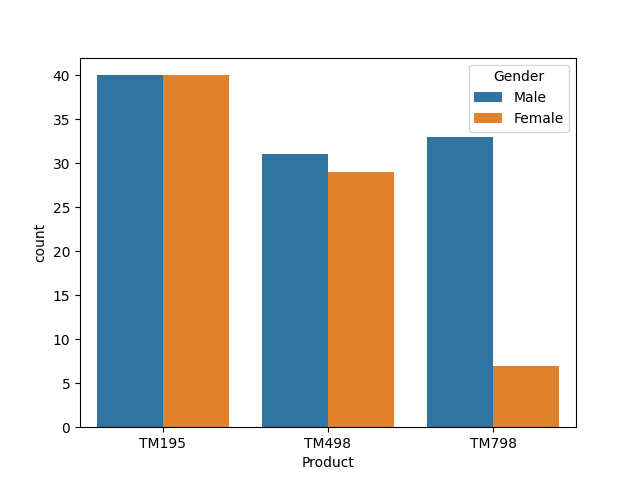
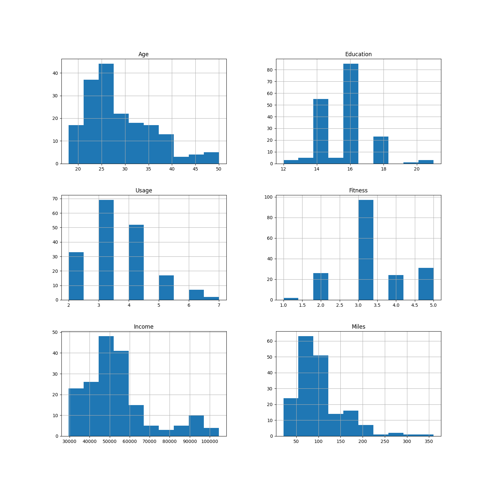
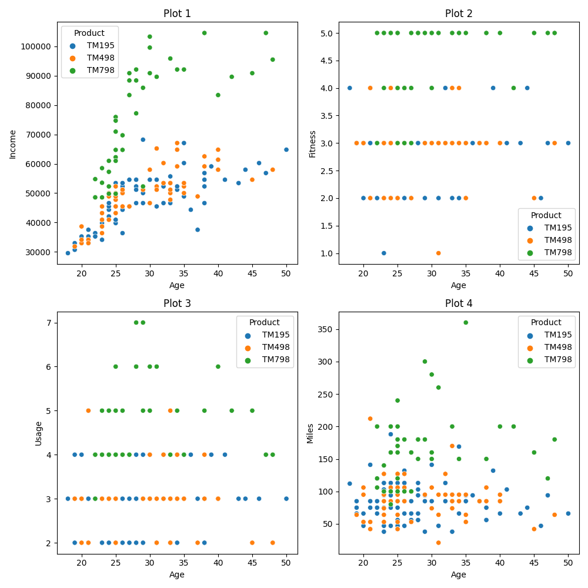

# Purpose
This problem is from Kaggle. The market research team at AdRight is assigned the task to identify the profile of the typical customer for each treadmill product offered by CardioGood Fitness. The market research team decides to investigate whether there are differences across the product lines with respect to customer characteristics. The team decides to collect data on individuals who purchased a treadmill at a CardioGoodFitness retail store during the prior three months. The data are stored in the CardioGoodFitness.csv file. The team identifies the following customer variables to study: product purchased, TM195, TM498, or TM798; gender; age, in years;education, in years; relationship status, single or partnered; annual household income ($); average number of times the customer plans to use the treadmill each week; average number of miles the customer expects to walk/run each week; and self-rated fitness on an 1-to-5 scale, where 1 is poor shape and 5 is excellent shape. Perform descriptive analytics to create a customer profile for each CardioGood Fitness treadmill product line.

# Requirements
The project structure must include the following files:
- Jupyter Notebook with:
    - Cells that perform descriptive statistics using Polars or Panda.
    - Tested by using nbval plugin for pytest
- Python Script performing the same descriptive statistics using Polars or Panda
- lib.py file that shares the common code between the script and notebook
- Makefile with the following:
    - Run all tests (must test notebook and script and lib)
    - Formats code with Python black
    - Lints code with Ruff
    - Installs code via:  pip install -r requirements.txt
- test_script.py to test script
- test_lib.py to test library
- Pinned requirements.txt
- GitHub Actions performs all four Makefile commands with badges for each one in the README.md

# CI/CD

## Make lint
Use Ruff instead of previous Pylint [Ignore F403 and F405 because of using `import *`]

## Make test
Run all tests. Tested by using nbval plugin for pytest in `.ipynb` and pytest for python script (`lib.py` and `main.py`)  
The coverage of testing is `100%`

## Make format
Formats code with Python black  

# Output
## Descriptive statistics

## Visualization
### Box plot

### Histogram plot

### Scatter plot

# Conclusion
From the above plots and forms, we can conclude(infer) that TM798 is the more expensive and better one.

# Lessons from the project
- Learned about the Python package and searching path. In Python, you can search for modules or packages in different directories using the sys.path list. `sys.path` is a list of directory names that Python uses to search for modules and packages when you import them in your code. You can modify this list to include additional directories for Python to search.
- Always organize your package structure clearly! Put the `lib.py`, `main.py`, etc. outside the directories.
- Watch out the current path you are in to execute the python script because it decides the relative path relationship.
- Github CI/CD path is different from codespace! They have different rootdir.
- Solutions
    - Use `sys.path.append('/workspace/project')` to add path for python searching
    - Use `os.chdir('/workspaces/project')` to keep the execution path is the base dir
